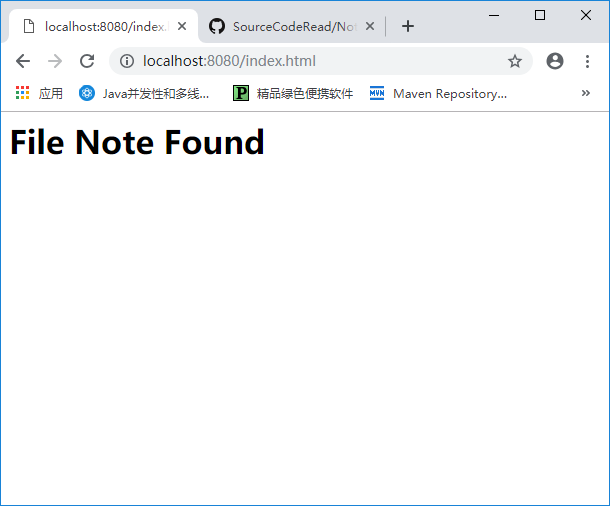

Web服务器也称超文本传输协议服务器（HyperText Transfer Protocol,HTTP），使用`HTTP`协议进行服务器与客户端（通常是Web浏览器）的通信。

通信依然是用`Socket`与`ServerSocket`。

## HTTP
* HTTP是基于“请求-响应”的协议，客户端发起请求，服务器进行响应
* HTTP使用可靠的TCP连接，默认使用TCP 80端口
* HTTP发展过程：HTTP/0.9 、HTTP/1.0 、HTTP/1.1

在HTTP中，总是**客户端通过建立连接并发送HTTP请求来初始化一个事务，WEB服务器并不负责联系客户端或者建立一个到客户端的回调连接**，也就是服务器仅仅是接受来自客户端的请求，并根据请求，将数据返回给客户端。

### HTTP请求
> HTTP请求包含三部分，以ASCII的形式传输
* 请求方法 统一资源标识符（URI） 协议/版本：出现在第一行。URI用于指定资源的完整路径。
* 请求头：包含客户端环境和请求实体正文的相关信息，例如浏览器使用的语言，各个请求头条目使用
回车换行间隔开。
* 实体：正文

```
POST /hello.txt HTTP/1.1
User-Agent: curl/7.16.3 libcurl/7.16.3 OpenSSL/0.9.7l zlib/1.2.3
Host: www.example.com
Accept-Language: en, mi

lastName=TheName&age=13
```
请求头个实体之间有一个空行，属于强制格式要求。

### HTTP响应
> HTTP响应包含三部分
* 状态行：协议 状态码 描述
* 消息报头（或响应头）
* 响应实体段


在消息报头和响应实体段之间也有一个空行。

## Socket和ServerSocket

## 应用程序
本章Web服务器代码在ex01.pyrmont包下，包含三个类
* HttpServer
* Request
* Response

### HttpServer
HttpServer类中包含`main`方法，因为http是请求-响应模式，所以服务器所做的就是等待请求，然后回复响应数据，因此在HttpServer类有一个`await()`方法，作用是
* 在指定的端口上等待HTTP请求
* 处理请求
* 返回响应信息给客户端

web通信涉及到文件资源的请求，所以在HttpServer中定义一个静态不可变类型的WEB_ROOT变量，用于指定存放静态资源文件的位置，这里的`System.getProperty("user.dir")`方法可以返回当前当前的工作目录，我使用的idea在‘D:\Program\java\workspace’下创建的工程名为‘TomCat’，而该方法的返回值为“D:\Program\java\workspace\TomCat”，可以通过System.getPropertys()方法查看所有可以得到的键值对。
```java
// Web服务器静态资源存放的位置
public static final String WEB_ROOT =
        System.getProperty("user.dir") + File.separator + "webroot";
```
创建`ServerSocket`对象，并在循环中监听端口的Socket连接。
```java
private void await() {
       ServerSocket serverSocket = null;
       try {
           serverSocket = new ServerSocket(NetConfig.PORT,
                   NetConfig.DEFAULT_BACKLOG_COUNT,
                   InetAddress.getByName(NetConfig.LOACAL_HOST));
           // 循环，等待监听
           while (!shutdown){
               Socket socket = null;

               try {
                   socket = serverSocket.accept();
                   // 对于每个连接解析数据
                   ...
               }catch (Exception e){
                   e.printStackTrace();
                   continue;
               }
           }

       } catch (IOException e) {
           e.printStackTrace();
       } finally {
         // 清理资源
       }
```
在循环中，对于每个新建立的连接，从连接的数据中，解析出`Request`对象，并生成`Response`对象
```java
Socket socket = null;
InputStream inputStream = null;
OutputStream outputStream = null;

try {
  socket = serverSocket.accept();
  inputStream = socket.getInputStream();
  outputStream = socket.getOutputStream();

  // 通过inputStream接收的数据，生成Request对象，并解析
  Request request =  new Request(inputStream);
  request.parse();

  // 创建Response对象
  Response response = new Response(outputStream);
  response.setRequest(request);
  response.sendStaticResource();

  shutdown = request.getUril().equals(SHUTDOWN_COMMAND);
  }catch (Exception e){
  e.printStackTrace();
  continue;
  } finally {
  if(socket != null){
  // 关闭套接字
  socket.close();
  }
}
```

### Request
一个Http请求对应一个Request对象，可以通过传入一个Socket.InputStream对象，读取数据，然后解析成Request对象。

从Request对象实现的功能来看，其主要作用是将文本类型的HTTP请求中的各部分属性以键值对的形式组织起来，方便使用，同时也可以做一些格式的验证等等。

第一章中Request对象仅仅关注请求行中的URI，所以仅仅是对URI进行了解析，解析过程自然是根据协议的格式规定：
> method <空格> URI <空格> 协议版本号 <回车换行>

取出求请第一个空格和第二个空格之间的内容
```java
public void parse(){
        StringBuffer request = new StringBuffer(2048);
        int i = 0;
        byte[] buffer = new byte[2048];
        try {
            i = inputStream.read(buffer);
        } catch (IOException e) {
            e.printStackTrace();
        } finally {
        }

        for (int j = 0; j < i; j++) {
            request.append(buffer[j]);
        }

        System.out.println(request.toString());
        uri = parseUri(request.toString());
    }

    // 请求头的格式是： method 空格 uri 空格 协议版本，所以可以通过空格定位uri
private String parseUri(String requestString) {
    int index1, index2;
    index1 = requestString.indexOf(' ');
    if(index1 != -1){
        index2 = requestString.indexOf(' ', index1 + 1);
        if(index2 > index1){
            return requestString.substring(index1 + 1, index2);
        }
    }
    return null;
}
```

### Response
Response对象对应一个HTTP响应，因为响应的内容是根据请求做出的，所以可以传入请求中对应的Request对象，并将`Socket.OutputStream`也传入，用于向客户端写数据。
```java


public class Response {
    //...
    Request request = null;
    OutputStream outputStream = null;

    public Response(OutputStream outputStream) {
        this.outputStream = outputStream;
    }

    public void setRequest(Request request) {
        this.request = request;
    }
    //...
}
```
在示例中，该Response类可以根据Request的请求，发送一个静态资源到浏览器，方法签名为`sendStaticResource`，具体实现如下：
```java
public void sendStaticResource() {
        byte[] bytes = new byte[BUFFER_SIZE];
        FileInputStream fileInputStream = null;


        try {
            File file = new File(HttpServer.WEB_ROOT, request.getUri());
            if(file.exists()){
                fileInputStream = new FileInputStream(file);
                int ch = fileInputStream.read(bytes, 0, BUFFER_SIZE);
                while (ch != -1){
                    outputStream.write(bytes, 0, ch);
                    ch = fileInputStream.read(bytes, 0, BUFFER_SIZE);
                }
            }else {// 文件不存在
                String errormessage = "HTTP/1.1 404 File Not Found\r\n" +
                "Content-Type:text/html\r\n" +
                "Content-Length:23\r\n"+
                "\r\n"+
                "<h1>File Note Found</h1>";
                outputStream.write(errormessage.getBytes());
            }
        } catch (IOException e) {
            e.printStackTrace();
            System.out.println(e.toString());
        } finally {
            if(fileInputStream != null){
                try {
                    fileInputStream.close();
                } catch (IOException e) {
                    // do nothing
                }
            }
        }
    }
```
这里对文件不存在的处理方式是返回一段HTML文本，提示文件未找到。

### 运行程序
运行了以下，发现程序出现了空指针异常，原因是`request.geturi()`方法返回值为`null`，而在该方法中主要是通过空格定位URI的，输出一下解析成字符串的`request`,发现时一串数字：
```
System.out.println(request.toString());
```
输出：
```
716984...(太长)
```
从byte到string的解析除了问题，原来是`request.parse()`方法中，用StringBuffer类的对象request进行字符到字符串的解析时，`request.append(buffer[j])`,没有对`buffer[j]`强转成char类型，修改代码如下，得到正确结果：
```java
for (int j = 0; j < i; j++) {
    request.append((char) buffer[j]);
}
```
浏览器输入：
```
http://localhost:8080/index.html
```
使用下面的代码对得到HTTP请求进行输出：
```java
System.out.print(request.toString()); // 这里没有使用自动回车换行的println()
System.out.println("-----------------------");
```
得到
```
GET /index.html HTTP/1.1
Host: localhost:8080
Connection: keep-alive
Cache-Control: max-age=0
Upgrade-Insecure-Requests: 1
User-Agent: Mozilla/5.0 (Windows NT 10.0; Win64; x64) AppleWebKit/537.36 (KHTML, like Gecko) Chrome/73.0.3683.86 Safari/537.36
Accept: text/html,application/xhtml+xml,application/xml;q=0.9,image/webp,image/apng,*/*;q=0.8,application/signed-exchange;v=b3
Accept-Encoding: gzip, deflate, br
Accept-Language: zh-CN,zh;q=0.9

-----------------------
```
可以观察到请求头下面有一个空行。

浏览器显示为：


到此，一个简陋的服务器就算是跑起来了。
再测试一下传文件的功能，分别测试了图片，文本，html文件，在谷歌浏览器上没有成功在页面显示，但是在windows10的Edge上正确显示，下面是图片的显示:

