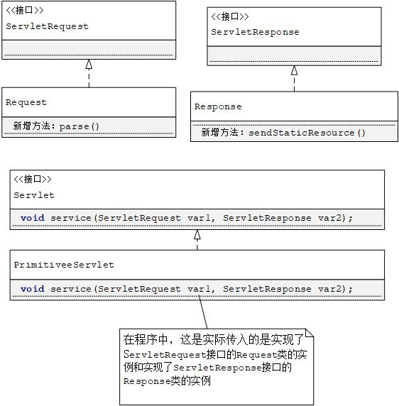

# 简单的servlet容器
共有两个应用程序
* 较简单的一个，仅仅用于说明servlet容器如何运行
* 由简单的那个演变而来，复杂一些

## javax.servlet.Servlet接口
Servlet编程需要使用到`javax.servlet`和`javax.servlet.http`两个包下面的接口和类。
这两个包可通过依赖工具添加（附[依赖查询链接](https://mvnrepository.com/artifact/javax.servlet/javax.servlet-api/4.0.1)）

在Servlet接口中声明了5个方法：
```java
public interface Servlet {
    void init(ServletConfig var1) throws ServletException;

    ServletConfig getServletConfig();

    void service(ServletRequest var1, ServletResponse var2) throws ServletException, IOException;

    String getServletInfo();

    void destroy();
}
```
`init()`、`service()`、`destroy()`与servlet生命周期相关。

当实例化某个servlet类后，servlet容器调用其`init()`方法进行初始化，该方法只会调用该方法一次，调用后就可以执行服务方法了`service()`，在servlet接受请求前，必须正确初始化实例（init()方法成功执行），其中编写仅仅需要执行一次地初始化，例如：
* 载入数据库驱动
* 初始化默认值等

该方法可以留空。

当servlet一个客户端请求到达后，servlet容器就会调用相应的servlet的`service()`方法，并将`javax.servlet.servletRequest`对象和`javax.servlet.ServletResponse`对象传入，其中`ServletRequest`对象包含客户端的HTTP请求信息，`ServletResponse`对象则封装servlet的响应信息。
在servlet对象的整个生命周期内，`service()`方法会被多次调用。

servlet实例从服务中移除前，servlet容器会调用servlet实例的`destroy()`方法，一般当servlet容器关闭或servlet容器要释放内存时，才会将servlet实例移除，而且只有当servlet实例的`service()`方法中的所有线程都退出后或执行超时后，才会调用`destory()`方法。

当servlet容器调用`destory()`方法让servlet对象有机会去清理自身持有资源，如内存、文件句柄和线程等，确保所有持久化状态与内存中该servlet对象当前的状态同步。

## 创建一个servlet如下
因为所有的servlet都要实现`javax.servlet.Servlet`接口。
```java

public class PrimitiveeServlet implements Servlet {

    public void init(ServletConfig servletConfig) throws ServletException {
        System.out.println("init()");
    }

    public ServletConfig getServletConfig() {
        return null;
    }

    public void service(ServletRequest servletRequest, ServletResponse servletResponse) throws ServletException, IOException {
        System.out.println("service()");
        PrintWriter out = servletResponse.getWriter();
        out.println("hello, this is message from PrimitveServlet");
    }

    public String getServletInfo() {
        return null;
    }

    public void destroy() {
        System.out.println("destory()");
    }
}
```
## Servlet容器1


servlet编程中，浏览器请求的是servlet，当然连接还是通过socket，这时候就会找到对应的servlet，完成初始化工作，并通过socke得到inputStream和outStream，分别构造解析成request和response，传入该servlet的serviece方法中。

> 对一个servlet的每个HTTP请求，一个功能齐全的servlet容器有以下几件事做：
1. 当第一次调用么讴歌servlet时，要载入该servlet类，并调用其`init()`方法（仅此一次）
2. 针对每个request请求，创建一个`javax.servlet.ServletRequest`实例和一个`javax.servlet.ServletResponse`实例
3. 调用该servlet的`service()`方法时，将servletRequest对像和servletResponse对象作为参数传入
4. 当关闭该servlet类时，将调用其`destory()`方法，并卸载该servlet类

下面的代码功能阉割，仅仅实现下面的工能：
> 1. 等待HTTP请求
2. 创建一个servletRequst对象和一个servletResponse对象
3. 若请求的是静态资源，则调用StataicResourceProcessor对象的process()方法，传入servletResquest对象和servletResponse对象
4. 若请求的是servlet，则载入相应servlet类，调用其`service()`方法，传入servletRequest对象和servletResponse对象。

### HttpServer类
整个程序的入口。接受HTTP请求。提供两个功能
* 请求静态资源，浏览器对应的URL为`http://hostname:port/staticResource`
* 请求servlet，浏览器对应的URL为`http://hostname:port/servlet/servletClass`

这里的处理方式是通过将不同类型的请求分发给不同类型对象处理实现的。
```java
// 判断请求的是静态资源还是servlet
                  if(request.getUri().startsWith("/servlet")) {
                      ServletProcessor1 processor = new ServletProcessor1();
                      processor.process(request, response);
                  }else{
                      StaticResourceProcessor processor = new StaticResourceProcessor();
                      processor.process(request, response);
                  }
```
### Request类
servlet的`service()`方法会从servlet 容器中接受一个javax.servlet.ServletRequest实例和一个javax.servlet.ServletResponse实例。

`ex02.pyrmont.Request`对象表示被传递给servlet的`service()`方法的一个Request对象，它必须实现javax.servlet.servletRequest接口中声明的方法。

相比于第一章的Request类，这个类实现了javax.servlet.ServletRequest接口，其他没有太大变化。

### Response
相比于第一章的Request类，这个类实现了javax.servlet.ServletResponse接口，其他没有太大变化。

```java

    // 第二个参数代表autoFlush()，选择true表示对println()方法的任何调用都会刷新输出，但是调用print()方法不会刷新输出
    // 因此，如果在servlet的sevice()方法最后一行调用print()方法，则内容不会被发送给浏览器。
    public PrintWriter getWriter() throws IOException {
        writer = new PrintWriter(outputStream, true);// 这里没有做判断就直接new一个，为什么呢?
        return writer;
    }
```
### StaticResourceProcessor
该类主要用来处理静态资源请求，里面也是调用的Response的方法。
```java
public class StaticResourceProcessor {
    // 这里直接调用了response的方法
    public void process(Request request, Response response) {
        response.sendStaticResource();
    }
}
```

有点像个代理。
### ServletProcessor1
用来处理servlet请求的，也只有一个`process()`方法，该方法接收两个参数，一个javax.servlet.ServletRequest实例和javax.servlet.ServletResponse实例。

通过
```java
String uri = request.getUri();
```
得到的URI格式为：
> /servlet/serletName
要得到servleName，也就是类名，通过
```java
String servletName = uri.substring(uri.lastIndexOf("/") + 1);
```
通过类加载器来加载类，通过java.net.URLClassLoader类来完成。
```java
public class URLClassLoader extends SecureClassLoader implements Closeable {...}
```
一旦创建，就可以使用它的loadclass()方法来载入servlet类，用下面这个构造函数：
```java
/**
     * Constructs a new URLClassLoader for the specified URLs using the
     * default delegation parent {@code ClassLoader}. The URLs will
     * be searched in the order specified for classes and resources after
     * first searching in the parent class loader. Any URL that ends with
     * a '/' is assumed to refer to a directory. Otherwise, the URL is
     * assumed to refer to a JAR file which will be downloaded and opened
     * as needed.
     *
     * <p>If there is a security manager, this method first
     * calls the security manager's {@code checkCreateClassLoader} method
     * to ensure creation of a class loader is allowed.
     *
     * @param urls the URLs from which to load classes and resources
     *
     * @exception  SecurityException  if a security manager exists and its
     *             {@code checkCreateClassLoader} method doesn't allow
     *             creation of a class loader.
     * @exception  NullPointerException if {@code urls} is {@code null}.
     * @see SecurityManager#checkCreateClassLoader
     */
    public URLClassLoader(URL[] urls) {
        super();
        // this is to make the stack depth consistent with 1.1
        SecurityManager security = System.getSecurityManager();
        if (security != null) {
            security.checkCreateClassLoader();
        }
        this.acc = AccessController.getContext();
        ucp = new URLClassPath(urls, acc);
    }
```
参数`urls`是一个java.net.URL的数组，每个URL指定要在哪里查找类文件（在servlet容器中，类载入器查找servlet类的目录称为仓库（repository））：
* 若一个URL以'/'结尾，则表明它指向的是一个目录
* 否则，URL默认指向一个JAR文件，根据需要载入器会下载并打开这个jar文件

在应用程序中，类载入器只需要查找一个位置，即工作目录下的webroot目录。
因此只需要创建包含一个URL的数组。创建URL时，使用的构造参数为
```java

    /**
     * Creates a URL by parsing the given spec with the specified handler
     * within a specified context. If the handler is null, the parsing
     * occurs as with the two argument constructor.
     *
     * @param      context   the context in which to parse the specification.
     * @param      spec      the {@code String} to parse as a URL.
     * @param      handler   the stream handler for the URL.
     * @exception  MalformedURLException  if no protocol is specified, or an
     *               unknown protocol is found, or {@code spec} is {@code null}.
     * @exception  SecurityException
     *        if a security manager exists and its
     *        {@code checkPermission} method doesn't allow
     *        specifying a stream handler.
     * @see        java.net.URL#URL(java.lang.String, java.lang.String,
     *                  int, java.lang.String)
     * @see        java.net.URLStreamHandler
     * @see        java.net.URLStreamHandler#parseURL(java.net.URL,
     *                  java.lang.String, int, int)
     */
    public URL(URL context, String spec, URLStreamHandler handler){...}
```
第二个参数指定一个目录，第一个和第三个可以传入null，但是因为还要另一个构造参数：
```java
public URL(String protocol, String host, String file)
        throws MalformedURLException {
    this(protocol, host, -1, file);
}
```

因此若使用：
```java
new URL(null, aString, null);
```
则编译器不指导是哪个函数。

然后就可以实例化URLClassLoader对象，然后载入对应的servlet对象，再调用其`service()`方法.

至此，本部分代码就结束了。

### 运行测试
没有使用命令行，而是直接使用idea，第一次运行请求servlet会出现`classNotFoundException`，首先说，请求是可以顺利到服务器的，只是对类的加载出了问题，在idea中，工程编译后，所有编译过的类默认放在
```
target/classes
```
文件夹下，所以更改一下仓库的路径：
```java
public static final String WEB_ROOT =
            System.getProperty("user.dir") + File.separator + "target" + File.separator + "classes"  
```
```java
File classPath = new File(Constants.WEB_ROOT);

String repository = (new URL("file", null, classPath.getCanonicalPath()
+ File.separator)).toString();
```
到这，类的仓库路径是ok的，但是识别一个类还需要加上包名，所以还需要做一些调整：
```java
String packageName = "ex02.pyrmont.";
String theFullPath = packageName + servletName;
myclass = loader.loadClass(theFullPath);
```
这个最多只能是个补救措施，勉强实现功能，代码很不优雅。

## 程序的修改版本（代码有些地方不合理）
继承关系：

也就是说，在定义的servlet中，因为通过service方法获得了`Response`和`Resquest`的实例：
```java
public void service(ServletRequest servletRequest, ServletResponse servletResponse) throws ServletException, IOException {...}
```
在这个方法中，可以通过下面的代码，将实例转型：
```java
Request request = (Request) servletRequest;
```
从而访问在`Request`中定义的`parse()`等，不安全。解决方法：**用外观类**。

整体的解决方案就是：
* 创建外观类：
    * 创建RequestFace实现ServletRequest接口
    * 创建ResponseFace实现ServletResponse接口
* 在外观类RequestFace中添加Request类的一个引用，由于RequestFace实现了ServletRequest接口，所以要实现该接口的所有方法，方法的具体实现直接调用Request成员属性的对应方法；
* 在外观类ResponseFace中添加Reponse类的一个引用，由于ResponseFace实现了ServletResponse接口，所以要实现该接口的所有方法，方法的具体实现直接调用Reponse成员属性的对应方法；
* (到此为止，该创建的类都创建好了)
* 当需要将Resquest类的实例myResqest和Response类的实例myResponse传入myServlet的service()方法时，使用如下代码：
```java
myServlet.service(new RequestFace(myResqest), new ResponseFace(myResponse));
```
这样，在Servlet中，就不能通过类型转换来访问Request和Response中的方法了。
