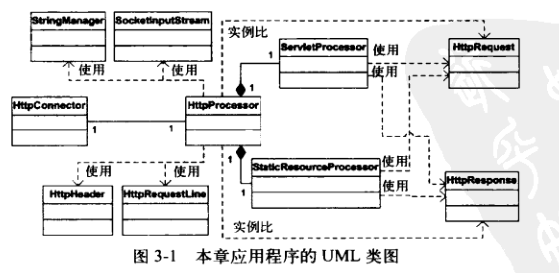

# 连接器

> 连接器的主要作用：接受http请求，创建`javax.servlet.http.HttpServletRequest`和`javax.servlet.http.HttpServletResponse`对象，并将这两个对象传入`service()`方法中。

### `org.apache.catalina.util`包下的`StringManager`类
> 该类用于处理不同模块和Catalina本身中错误消息和国际化操作。

#### 一个包下一个propertise文件存储错误信息

Tomcat处理错误消息的方法是将错误消息存储在一个properties文件中，便于读取和编辑。但是若将所有错误信息放在一个properties文件中，则会导致该文件过于庞大，不利于维护。

Tomcat为解决错误信息放在一个文件中导致文件庞大的问题，使用的解决方案为：**将properties文件划分到不同的包中**，每个包下的properties文件包含该包下任何类可能抛出的所有异常信息。

对于国际化的支持，需要创建properties文件的地方，都会创建多个（三个），命名不同，对应不同的语言。
* LocalStrings.properties - 英文
* LocalStrings_es.properties - 西班牙语
* LocalStrings_jp.properties - 日文

#### 一个`StringManager`实例处理一个properties文件

每个存储错误信息的properties文件需要一个StringManager类的实例来处理，当包中某个类需要在其包内的properties文件中查找错误信息时，会首先获取对应的StringManager类的实例，为了少创建对象，同一个包下的所有类公用一个StringManager对象，单例模式。

在`StringManager`类中维护一个Hashtable对象，key是包名，value是StringManager类的实例，所以可以直接通过包名进行查找。

该StringManger对象会根据语言环境自动读取对应语言的properties文件。

当需要获取错误消息时，可以使用StringManger的`getString`方法的到对应的错误信息。
例如在英文环境下，包`ex03.pymont.connector.http`下的properties中存储内容为：
```
name=hello
```
那么直接使用
```java
StringManger manger = StringManager.getManager("ex03.pymont.connector.http");
String name = manger.getString("name");
```
### 应用程序
应用按模块划分为：连接器模块、启动模块、核心模块：
* 连接器模块
  > * 连接器及其支持类（HttpConnector和HttpProcessor）
  * 表示Http请求类（HttpRequest）及其支持类
  * 表示Http响应类(HttpResponse)及其支持类
  * 外观类（HttpRequestFacade和HttpResponseFacade）
  * 常量类
* 启动模块
  > 只有一个类，Bootstrap，负责应用程序的启动
* 核心模块
  > ServletProcesstor和StaticResourceProcesstor

UML类图


`HttpServer`被分成了`HttpConnector`和`HttpProcessor`两个类，`Response`和`Request`类被`HttpResponse`和`HttpRequest`代替。

`HttpConnector`负责等待Http请求，`HttpProcessor`负责创建`Request`和`Response`对象。

连接器需要从Http中解析各种属性，但是servlet并那不一定会用到这些参数，所以采用延迟的方式：**在真正调用前不会解析**，获得更好的性能。

#### 启动应用程序
通过`ex03.pyrmont.startup.Bootstrap`类启动。
```java
package ex03.pyrmont.startup;

import ex03.pyrmont.connector.http.HttpConnector;
public class Bootstrap {
    public static void main(String[] args) {
        HttpConnector connector = new HttpConnector();
        connector.start();
    }
}
```
在主函数中实例化`HttpConnector`类，调用`start()`方法，`HttpConnector`负责连接。

#### HttpConnector类

定义如下：
```java
public class HttpConnector implements Runnable{
    boolean stopped;
    private String scheme = "http";

    public String getScheme() {
        return scheme;
    }

    public void start() {
        Thread thread = new Thread(this);
        thread.start();
    }

    @Override
    public void run() {
        ServerSocket serverSocket = null;
        try {
            serverSocket = new ServerSocket(NetConfig.PORT, 1, InetAddress.getByName(NetConfig.LOACAL_HOST));
        } catch (IOException e) {
            e.printStackTrace();
            System.exit(1);
        }

        while (!stopped){
            // 接受请求
            Socket socket = null;
            try {
                socket = serverSocket.accept();
            } catch (IOException e) {
                continue;
            }
            // 处理请求
            HttpProcessor processor = new HttpProcessor(this);
            processor.process(socket);
        }
    }
}
```
`ex03.pyrmont.connector.http.HttpConnector`类的实例，实现了`java.lang.Runnable`接口，在`run()`方法中，负责创建一个服务器套接字，并循环等待连接。调用其`start()`方法会创建一个线程运行该Runnable的子类。

在`run()`方法的`while(...){...}`循环中，执行以下操作：
* 等待Http请求
* 为每个Http请求创建一个`HttpProcessor`实例
* 调用`HttpProcessor`对象的`process()`方法

#### `HttpProcessor`类
`HttpProcessor`类在创建时，传入的参数有两个：
* 服务端套接字接收到的socket的实例
* HttpConnector类的实例（这个实例目前只有一个）
而在该类中完成以下几件事：
* 创建一个HttpRequest对象和一个HttpResponse对象（因为传入了socket，所以可以读取数据）
* 解析HTTP请求的第一行内容和请求头信息，填充HttpRequest对象
* 将HttpRequest对象和HttpResponse对象传递给ServletProcessor或StaticResourceProcessor的`service()`方法。

每个连接都会创建一个`HttpProcessor`对象，该对象有`HttpRequest`何`HttpResponse`的引用，因此可以在`HttpProcessor`中实现对请求的解析。

#### 创建HttpRequest对象
`HttpRequest`类实现了`javax.servlet.http.HttpServletRequest`类，并通过 外观类 `HttpRequestFaced`实现门面模式，实现对类内方法的保护（同上一章）。

HttpRequest对象其实就是将http报文解析管理的类，可以理解为http参数的容器。

在书中，将http请求参数分为三类进行分别存储：

* 请求头的信息，存储在 `protected HashMap Header = new HashMap();`中；
* Cookie，存储在`protected ArrayList cookies = new ArrayList();`中
* 请求参数，存储在`protected ParameterMap Parameters = null;`中。

通过集合类存储解析后的信息，就可以调用方法的得到各种属性值了，所所以主要工作是解析HTTP请用于填充HttpRequest对象。

对每个请求头和Cookie，HttpRequest类都提供了`addHeader()`和`addCookie()`方法类填充相关信息，这两个方法会又`HttpProcessor`的`parseHeaders()`方法来调用。当真正需要参请求参数时，才会使用`HttpRequest`的` parseParameters()`方法解析请求参数。

本部分主要包含以下内容：

*  读取套接字的输入流
* 解析请求行
* 解析请求头
* 解析Cookie
* 获取参数

1. 读取套接字的输入流


我爱你  快学习！！！！
